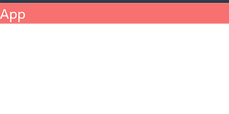

# React setup

## What is React?
React is a JavaScript library for building user interfaces. It is maintained by Facebook and a community of individual developers and companies. React can be used as a base in the development of single-page or mobile applications.

## How to install React
There are two (main) ways to install React:
- Using `create-react-app`: **Advantages**: It is the easiest way to get started with React. **Disadvantages**: It is not as flexible as setting up React from scratch.
- Using `vite`: **Advantages**: It is faster than `create-react-app`. **Disadvantages**: It is not as beginner-friendly as `create-react-app`.

We shall use vite to set up our React app. To create a vite app, run the following command in the **root directory** of your terminal:


```bash
npm create vite@latest
```
If vite is not installed, a prompt will appear asking you to install it. Press `y` and hit `Enter` to install vite. After installing vite, you will be prompted to enter the name of your project. Enter the name of your project and hit `Enter`. Vite will now ask the framework you want to use. Select `react` and hit `Enter`. It will now ask if you want to use TypeScript or JavaScript. We shall use JavaScript, so hit `Enter`. Vite will now create a new directory with the name of your project and set up a new React app for you.

Now go into the directory of your project by running the following command in your terminal:

```bash
cd <project-name>
npm i
```

## Using Tailwind
Tailwind CSS is a utility-first CSS framework for rapidly building custom designs. It is a low-level framework that provides you with all the building blocks you need to build your own designs. To use Tailwind in your React app, you need to install the `tailwindcss` package. You can do this by running the following command in your terminal. But first visit the [Tailwind website](https://tailwindcss.com/) or dirctly visit the [quickstart guide for vite](https://tailwindcss.com/docs/guides/vite).

Installation
```bash
npm install -D tailwindcss postcss autoprefixer
npx tailwindcss init -p
```

After installing the `tailwindcss` package, you can replace it in your React app by adding the following line of code to your `tailwind.config.js` file:

```css
/** @type {import('tailwindcss').Config} */
export default {
  content: [
    "./index.html",
    "./src/**/*.{js,ts,jsx,tsx}",
  ],
  theme: {
    extend: {},
  },
  plugins: [],
}
```

Now you can replace the code of `index.css` with the following code:

```css
@tailwind base;
@tailwind components;
@tailwind utilities;
```

Delete `App.css` for now

In the `App.jsx` file, replace the code with the following:

```jsx
import React from 'react'

const App = () => {
  return (
    <div className='bg-red-400 text-white'>
      App
    </div>
  )
}

export default App
```
To make development easier, you use the ES7 React/Redux/GraphQL/React-Native snippets extension in VSCode. This extension provides you with a lot of snippets that you can use to write your code faster. Using `rafce` snippet will create a functional component with an export statement.

To run this code in your browser, run the following command in your terminal:

```bash
npm run dev
```
Unlike the modules before you have to run the command in the `frontend` directory. This will start a development server and open your app in your default browser. The output will look like this:
