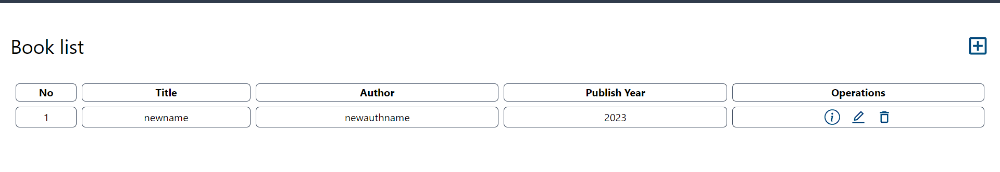

# Showing books in react

In this part we need both the frontend and the backend of the project and we will be using the backend from the previous part.

## Packages needed

First cd into the frontend folder and run the following command to install the packages needed.

```bash
cd frontend
npm install axios react-icons
```
Axios is a promise based HTTP client for the browser and node.js and react-icons is a library that provides popular icons for your react project.

## Tweaking the backend
Open the `/backend/index.js` and do the following changes.

```javascript
app.use(cors());
// app.use(cors({
//     origin: 'http://localhost:5000',
//     methods: 'GET, POST, PUT, DELETE',
//     allowedHeaders: 'Content-Type'
// }));
```
We are commenting out the cors options because we are not going to use it in this part.

## Creating react components for loading state
Create a folder in `frontend/src` called `components` and create a file called `Spinner.jsx` and add the following code.

```jsx
import React from 'react'

function Spinner() {
  return (
    <div className='animate-ping w-16 h-16 m-8 rounded-full bg-sky-600'></div>
  )
}

export default Spinner
```

This is a simple spinner component that we will use to show the user that the books are being loaded.

## Now we have to create a component to show the books

Modifying `frontend/src/page/Home.jsx` to show the books.

```jsx
import React from 'react'
import { useState, useEffect } from 'react'
import axios from 'axios'
import Spinner from '../components/Spinner'
import { AiOutlineEdit } from 'react-icons/ai'
import { BsInfoCircle } from 'react-icons/bs'
import { MdOutlineAddBox, MdOutlineDelete } from 'react-icons/md'
import { Link } from 'react-router-dom';

function Home() {
  const [books, setBooks] = useState([]);
  const [loading, setLoading] = useState(false);
  useEffect(() => {
    setLoading(true);
    axios.get('http://localhost:5000/books').then((response) => {
      setBooks(response.data.data);
      setLoading(false);
  }).catch((error) => {
      console.log(error);
      setLoading(false);
  });
  }, []);
  return (
    <div className='p-4'>
      <div className='flex justify-between items-center'>
        <h1 className='text-3xl my-8'>Book list</h1>
        <Link to ='/books/create'>
          <MdOutlineAddBox className='text-sky-800 text-4xl' />
        </Link>
      </div>
      {loading ? (
      <Spinner />
      ) : (
        <table className='w-full border-separate border-spacing-2' >
          <thead>
            <tr>
              <th className='border border-slate-600 rounded-md'>No</th>
              <th className='border border-slate-600 rounded-md'>Title</th>
              <th className='border border-slate-600 rounded-md max-md:hidden'>Author</th>
              <th className='border border-slate-600 rounded-md'>Publish Year</th>
              <th className='border border-slate-600 rounded-md max-md:hidden'>Operations</th>
            </tr>
          </thead>
          <tbody>
            {books.map((book, index) => (
              <tr key={book._id} className='h-8'>
                <td className='border border-slate-700 rounded-md text-center'>
                  {index + 1}
                </td>
                <td className='border border-slate-700 rounded-md text-center'>
                  {book.title}
                </td>
                <td className='border border-slate-700 rounded-md text-center'>
                  {book.author}
                </td>
                <td className='border border-slate-700 rounded-md text-center'>
                  {book.publishYear}
                </td>
                <td className='border border-slate-700 rounded-md text-center'>
                  <div className='flex justify-center gap-x-4'>
                    <Link to={`/books/details/${book._id}`}>
                      <BsInfoCircle className='text-sky-800 text-2xl' />
                    </Link>
                    <Link to={`/books/edit/${book._id}`}>
                      <AiOutlineEdit className='text-sky-800 text-2xl' />
                    </Link>
                    <Link to={`/books/delete/${book._id}`}>
                      <MdOutlineDelete className='text-sky-800 text-2xl' />
                    </Link>
                  </div>
                </td>
              </tr>
              ))}
          </tbody>
        </table>
      )}
    </div>
  )
}

export default Home
```

Explanation of the code:
This is a React component named `Home` that fetches and displays a list of books from a backend server. Here's a breakdown of what each part of the code does:

1. **Imports**: The necessary modules and components are imported. This includes React itself, the `useState` and `useEffect` hooks from React, the `axios` library for making HTTP requests, a `Spinner` component (presumably a loading spinner), several icons from `react-icons`, and the `Link` component from `react-router-dom`.

2. **State Variables**: Two state variables are declared using the `useState` hook: `books` (an array to store the list of books) and `loading` (a boolean to track whether the data is currently being fetched).

3. **Data Fetching**: The `useEffect` hook is used to fetch the list of books from the backend server when the component is first rendered. The `axios.get` function is used to make a GET request to the server. If the request is successful, the response data is stored in the `books` state variable and `loading` is set to `false`. If an error occurs, it's logged to the console and `loading` is also set to `false`.

4. **Rendering**: The component returns a JSX element that displays a list of books. If the data is still being fetched (`loading` is `true`), a `Spinner` component is displayed. Otherwise, a table is displayed with each book's details. Each book has links to its detail, edit, and delete pages, which are created using the `Link` component from `react-router-dom`.

5. **Export**: Finally, the `Home` component is exported for use in other parts of the application.

Modifying `frontend/src/App.js` to show the `Home` component.

```jsx
import React from 'react'
import { Routes, Route } from 'react-router-dom'
import Home from './page/Home'
import ShowBook from './page/ShowBook'
import EditBook from './page/EditBook'
// import NewBook from './page/NewBook'
import CreateBook from './page/CreateBook'
import DeleteBook from './page/DeleteBook'

const App = () => {
  return (
    <Routes>
      <Route path='/' element={ <Home /> } />
      <Route path='/books/create' element={ <CreateBook /> } />
      <Route path='/books/details/:id' element={ <ShowBook /> } />
      <Route path='/books/edit/:id' element={ <EditBook /> } />
      <Route path='/books/delete/:id' element={ <DeleteBook /> } />
    </Routes>
  )
}

export default App
```

## Running the code
To run this code two instances of the terminal must be made. One for the backend and the other for the frontend. In the backend terminal run the following command.

```bash
cd backend/
npm run dev
```

In the frontend terminal run the following command.

```bash
cd frontend/
npm run dev
```

Open the link provided by the frontend page and you will see the books being displayed.

**Preview of the page:**
